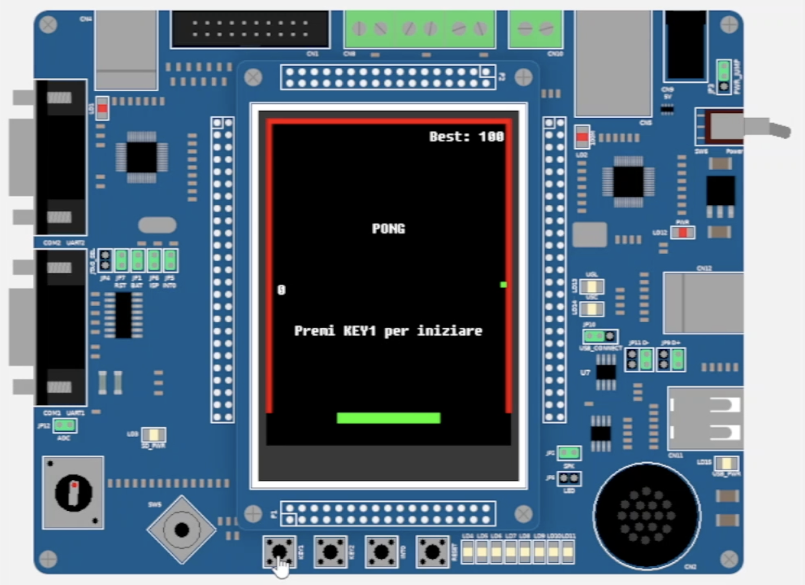
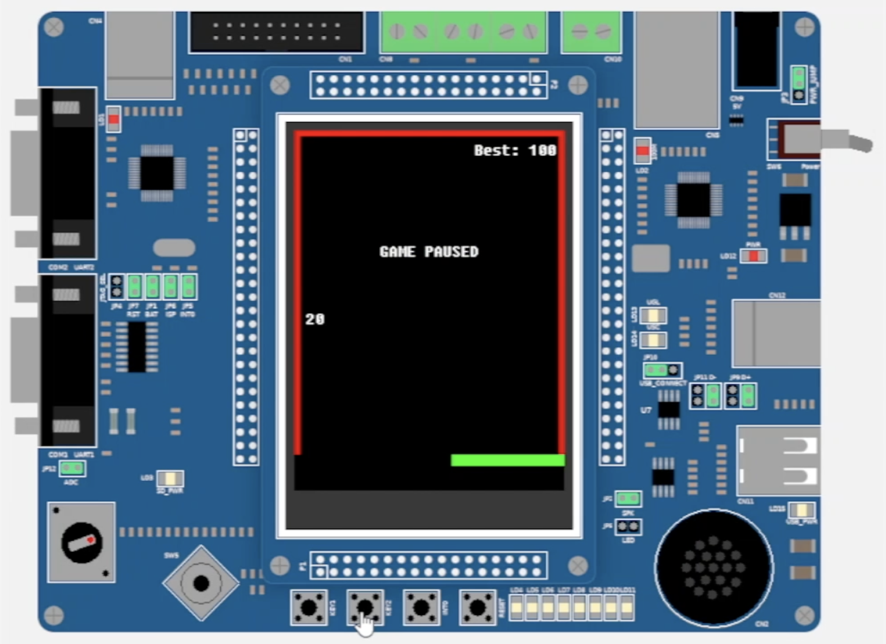

# LandTiger Pong

Questo repository contiene una versione semplificata di Pong, un gioco originariamente sviluppato dalla Atari, scritto per la [scheda LandTiger](https://os.mbed.com/users/wim/notebook/landtiger-baseboard/) durante il corso di Architetture dei sistemi di elaborazione al Politecnico di Torino.

[🌐 Here in English](README.md)

## Feature
- Gioca una versione single-player del gioco, nella quale viene registrato il miglior punteggio
- Gioca una versione multiplayer del gioco contro il computer

## Funzionamento

Il progetto è stato sviluppato in C per studiare il funzionamento a basso livello della scheda.
Il software ha quattro stati differenti di funzionamento, `TITLESCREEN`, `INGAME`, `GAMEPAUSED` and `GAMEOVER`.  
Quando viene iniziata una partita, il timer 0 avvia una conversione analogico-digitale sul potenziometro: il risultato della conversione verrà utilizzato al successivo tick del timer per determinare la posizione della racchetta.  
Dopo aver mosso la racchetta secondo la sua velocità, viene eseguito un controllo delle collisioni per la pallina, verificando possibili collisioni con le pareti o con la racchetta stessa. In tal caso, la velocità della pallina viene invertita (garantendo una riflessione il cui angolo è uguale all'angolo di incidenza). Se la pallina ha colliso con la racchetta, la sua velocità orizzontale è determinata anche dalla velocità della racchetta, rendendo il gameplay meno prevedibile. In caso di collisione, uno specifico suono viene riprodotto utilizzando il timer 1.  
Infine, dopo aver aggiornato il punteggio in caso di collisione, la pallina viene mossa e il processo viene poi ripetuto al successivo tick del timer.

## Screenshot

|  Schermata iniziale |  Partita in pausa |
| :-------------: | :-------------: |